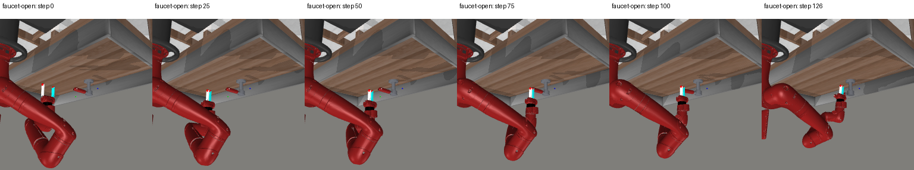
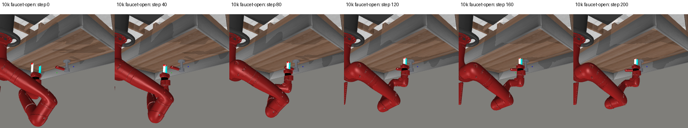
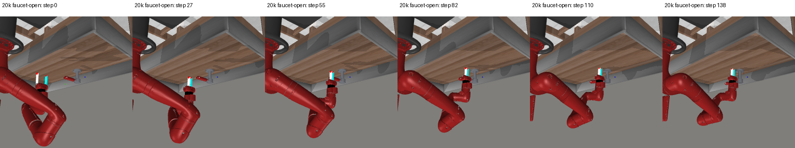
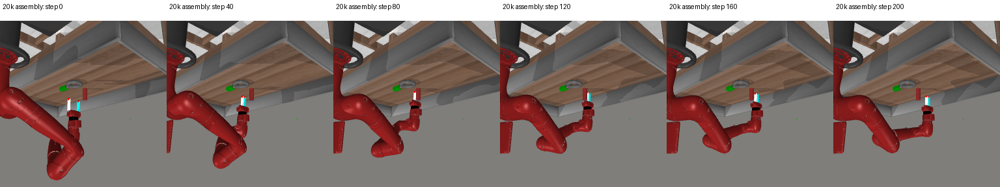

# LeFlow with nonlinear episodic TTT: completed first run

October 10, 2026. One seed 3072 run completed 20,000 total charged updates and all
four fixed 104 development evaluations. Selected checkpoint: 20,000,
**29/104 (27.9%)**, versus frozen LeFlow's selected 10k
**21/104 (20.2%)**. The observed gain is 7.69 percentage
points, with 12 paired wins and 4 regressions.
This is an improvement over our audited released-code LeFlow port under the
registered ceilings. It is not a native-benchmark, matched-convergence,
equal-consumed-compute, generalization or state-of-the-art claim.

## Complete comparison

| Total charged updates | Frozen LeFlow | LeFlow + TTT | TTT timeouts |
|---:|---:|---:|---:|
| 5,000 | 14/104 (13.5%) | 27/104 (26.0%) | 0 |
| 10,000 | 21/104 (20.2%) | 21/104 (20.2%) | 0 |
| 15,000 | 19/104 (18.3%) | 27/104 (26.0%) | 0 |
| 20,000 | 14/104 (13.5%) | 29/104 (27.9%) | 0 |

Selection is highest development success with the earliest checkpoint on ties.
The original LeFlow source and results remain unchanged. Our earlier, materially
different execution-revision controller remains 80/104; this direct LeFlow
extension is not the strongest method in the project.

## Central mechanism

Teach LeFlow to revise its latent plans from recent execution errors. Frozen JEPA
features/world predictions provide the consequence space; LeFlow's flow generates
latent paths. A 6,144-weight nonlinear episodic memory is fitted to observed
10-action outcomes and conditions flow generation, inverse decoding and candidate
verification. Offline meta-training optimizes those inner updates for later
recorded actions/outcomes. The context is separate from physical JEPA states.

This adapts LaCT's nonlinear memory, Elastic TTT's stability principle and SCOUT's
future-action meta-objective. It is not a full reproduction of any of them.
See the [method, equations in code, source pins and literature](LEFLOW_TTT_RUN.md).
Four inner updates were used in every formal evaluation. We have not demonstrated
inference scaling or isolated online adaptation's causal contribution.

## What worked and what failed

- The selected checkpoint records at least one success on 6 of 13 task
  types in this eight-case-per-task suite; 7 tasks remain 0/8. Gains are uneven rather than general manipulation competence.
- Training trades capabilities across tasks. Faucet-open goes 8/8 → 1/8 → 0/8 → 7/8 across the four checkpoints.
  Door-close goes 0/8 → 0/8 → 4/8 → 1/8. Falling expert
  action loss is not sufficient evidence of better task control.
- At matched initial observations/goals/noise seeds, latent-path dispersion falls
  60.3% from 5k to 20k; decoded-action dispersion falls 16.0%.
  This is a diagnostic correlation, not proof that reduced diversity causes failure.
- At the selected checkpoint, online fitting lowers observed full-outcome MSE
  only 0.94% versus the same checkpoint's learned prior on chunks with
  history (0.012549 versus 0.012668).
  These are identical executed actions within each comparison, not counterfactual
  labels for unexecuted candidates.
- In 33 of 75 selected-checkpoint failures, the last
  observed chunks have nonpositive mean latent goal progress while the corrected
  candidate score still predicts positive progress. Candidate scores use raw
  commands before simulator clipping, which is a remaining mismatch; clipped-
  action outcome errors are logged separately.
- There are 0 timeouts across 416 evaluations.
  Selected mean controller decision latency is 104.19 ms.
  The main observed contact stalls therefore are not deadline failures.

| Task | Selected checkpoint success |
|---|---:|
| assembly | 0/8 |
| button-press-topdown | 0/8 |
| coffee-button | 7/8 |
| dial-turn | 0/8 |
| door-close | 1/8 |
| door-open | 0/8 |
| drawer-close | 5/8 |
| drawer-open | 0/8 |
| faucet-open | 7/8 |
| handle-press | 8/8 |
| pick-place | 0/8 |
| plate-slide | 0/8 |
| reach | 1/8 |

Four 5k traces and two paired 10k traces were visually inspected. The faucet case
below succeeds at action 126 at 5k, but at 10k approaches the handle and then shows
little useful motion through action 200. The drawer case 00004 instead improves
from failure at 200 actions to success at 38. Contact force or exact physical
causes cannot be inferred from these frames alone.

[Visual observations](reports/20261010-leflow-ttt/round1-visual-review.json) and
[paired observations](reports/20261010-leflow-ttt/round2-visual-review.json) distinguish
selected illustrative traces from aggregate measurements.

Four traces from the final selected checkpoint were also inspected. The faucet
case now succeeds at action 138 and the drawer case at action 32. Assembly and
door-close case 00000 still fail at 200 actions: the gripper moves near or past
the objects without completing their required manipulation. These cases remain
failures despite available controller time.

[Selected-checkpoint visual review](reports/20261010-leflow-ttt/final-visual-review.json).

## Budget, data and claim limits

Same 6,222 successful expert training episodes,
13 MetaWorld tasks, frozen V-JEPA2.1 encoder/world, normalization and query draws.
Same 104 development cases, 200 primitive actions and 10 cumulative controller
seconds per episode. Memory resets between episodes. The sealed 3,200-case final
suite was not opened. Sampling is with replacement, not an epoch-based schedule.

The exact baseline spatial adapter is shared: its original 2k updates and
193.797 optimization GPU-seconds are charged. All flow, inverse and memory weights
start fresh; 18k new updates at global batch 64 give 1,152,000 planner queries. Same 20k-update
and 28,800 optimization GPU-second ceilings. Actual optimization cost is
2.437308 GPUh versus LeFlow 0.852418 GPUh. Through
our selected checkpoint it is 2.437308 GPUh versus 0.400696 GPUh for
LeFlow's selected 10k checkpoint. Validation/diagnostic forward time is separately
2.373836 GPUh for this run. Do not call actual consumed
compute equal merely because the ceilings match.

The baseline is stable and audited for this custom experiment. Its frozen world,
spatial adapter decoder and schedule are port choices; native LeFlow benchmarks
and matched convergence have not been reproduced. Repeated development-set use,
one model seed and checkpoint selection limit statistical/generalization claims.

## Next decision

Keep execution-feedback TTT as a research direction, but target the observed
prediction-to-action gap. First isolate the online update at the selected
checkpoint using a controlled comparison; then test whether goal-progress-aware
calibration and stronger action changes after observed stalls help. More inner
updates or a larger reasoner alone are not justified by this run. No additional
training, ablation, scaling sweep, baseline rerun or final test was launched.

## Verification and preserved evidence

Seven behavior tests and an 8-GPU/global-batch-64 gradient check passed before launch.
The [final CPU audit](reports/20261010-leflow-ttt/final-audit.json) verified
56 runtime hashes, 12 sealed
artifact hashes, unchanged baseline adapter tensors, best/last checkpoint identity,
source, manifest fields, frozen world, paired cases, episode resets and budgets.
W&B is finished. All owned workers exited and all eight GPUs were idle at
17:12:49 UTC; see the [health check](reports/20261010-leflow-ttt/final-health.json).
No new model/simulator calls were made for postrun analysis.

[Complete paired analysis](reports/20261010-leflow-ttt/analysis-round-4.json),
[sealed registry](reports/20261010-leflow-ttt/run/registry.json),
[compute ledger](reports/20261010-leflow-ttt/run/compute_usage.json),
[W&B](https://wandb.ai/attentionx2023/flow-jepa-metaworld/runs/jkidk24s).

Frozen execution source: `70c19323351b7fe2756f52ec6968b75f65abe7a2`.
Server record: `/home/mtxu/adam/LeFlow-experiments/20261010-leflow-ttt`.
Reproduce analysis with `scripts/analysis/leflow_ttt_details.py` and final audit
with `scripts/analysis/audit_leflow_ttt.py`; preserve the execution checkout.
