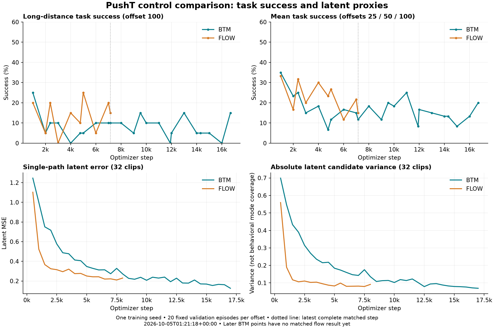

# PushT flow/BTM pilot: progress and failure analysis

**Frozen snapshot: October 5, 2026, 01:21:18 UTC / October 4, 9:21:18 PM EDT.**

The pilot has **not demonstrated either improved long-horizon task success or a success-preserving controller speedup**. Both methods are training normally, but better latent-space diagnostics have not translated into reliable task improvement. BTM's strongest validation checkpoint remains its first evaluated checkpoint. These are interim, single-seed validation findings, not final benchmark results.

This experiment compares a one-step BTM generator with this fork's matched 16-step flow baseline using frozen **LeWM on PushT**. It is not an exact published-LeFlow reproduction and does not implement V-JEPA 2.1/Meta-World. The primary endpoint is validation success at dataset goal offset 100; mean success over offsets 25/50/100 selects checkpoints.

## Run state, budget, and completion estimate

BTM continues on A800 GPUs 0–3; flow runs concurrently on GPUs 4–7. Each receives four GPUs, ten epochs, **23,830 optimizer updates**, global batch 128, microbatch 32, and 3,050,240 training-clip presentations. Both use seed 3072, the same encoder/cache, episode split, optimizer settings, architecture dimensions, and controller budgets. Flow has additional time-conditioning parameters. Equal examples, updates, and allocation do not imply equal FLOPs or GPU-hours.

| Method | Saved update / target | Latest complete rollout evaluation | Estimated finish, Oct. 4 EDT | Planning range |
|---|---:|---:|---|---|
| BTM | 17,000 / 23,830 (71.3%) | 16,681 | **10:01 PM** | 9:54–10:08 PM |
| Flow | 8,000 / 23,830 (33.6%) | 7,149 | **11:09 PM** | 10:52–11:26 PM |

These estimates include remaining optimization, scheduled validation, rollout evaluations, and finalization for the **current two training runs only**. They exclude final-test evaluation, additional seeds, and improvement experiments. The model fits time between completed three-offset evaluations under concurrent load; ranges vary fitted rates by ±15% and are planning ranges, not confidence intervals. Evaluation dominates remaining time: approximately 31 of BTM's 39 remaining minutes and 95 of flow's 107 minutes. Failures, restarts, or changed host load can shift completion. See [ETA assumptions and calculations](../snapshots/20261005T012118Z/eta.json).

Both methods remain frozen at [69babde283f504120dae3dfc6e9188a0e2242be4](https://github.com/Abecid/LeFlow-/commit/69babde283f504120dae3dfc6e9188a0e2242be4). Fifteen-minute monitoring is active. Report branch: `codex/server-launch-20261004`. Analysis does not change active training settings.

## Results at comparable checkpoints

Every evaluation uses 20 fixed, distinct validation episode/start pairs per offset, evaluation seed 42, and a 200-action budget. BTM step 17,000 and flow step 8,000 rollout evaluations are incomplete in this snapshot, so their partial offsets are excluded from complete-cycle comparisons.

| Comparison | Method | Update | Success @25 | @50 | @100 | Mean |
|---|---|---:|---:|---:|---:|---:|
| Selected best, matched | BTM | 1,000 | 40% | 40% | 25% | 35.00% |
| Selected best, matched | Flow | 1,000 | 50% | 30% | 20% | 33.33% |
| Latest complete, matched | BTM | 7,149 | 10% | 15% | 10% | 11.67% |
| Latest complete, matched | Flow | 7,149 | 20% | 10% | 15% | 15.00% |
| Later BTM only, **unmatched budget** | BTM | 16,681 | 20% | 25% | 15% | 20.00% |

At update 7,149, the primary BTM-minus-flow difference is **−5 percentage points**, with paired episode-bootstrap 95% interval **[−25, +15]**. Two episodes succeed only with BTM, three only with flow, none with both, and fifteen with neither. The selected checkpoints' offset-100 difference is +5 points, interval [−15, +25]. Neither comparison establishes an advantage or equivalence. Episode intervals exclude training-seed uncertainty; repeatedly inspecting the same cases does not create independent trials.

Both actual `best.pt` payloads identify update 1,000. Selection maximizes mean validation success, retaining the earlier checkpoint on ties ([selection code](https://github.com/Abecid/LeFlow-/blob/69babde283f504120dae3dfc6e9188a0e2242be4/train_subgoals.py#L488-L509)). Later BTM mean success never exceeds 25% across the remaining 22 completed evaluations. Offset-100 success falls to zero at 16,000 and rebounds to 15% at 16,681: regression and fluctuation are observed; monotonic collapse is not.



Reproducible numbers: [training/validation CSV](../snapshots/20261005T012118Z/training_metrics.csv), [rollout CSV](../snapshots/20261005T012118Z/evaluation_metrics.csv), [paired-success CSV](../snapshots/20261005T012118Z/paired_success.csv), [episode transitions](../snapshots/20261005T012118Z/episode_transitions.csv), [paired reports](../snapshots/20261005T012118Z/paired_evaluations.json), and [snapshot summary/provenance](../snapshots/20261005T012118Z/summary.json).

## Observed behavior versus possible explanations

**Observed: latent errors improve while success remains weak.** At offset 100, BTM's predicted goal error falls from 0.862 at update 1,000 to 0.456 at 16,681; predicted waypoint error falls 1.002→0.388 and observed subgoal residual 0.913→0.254. Task success falls 25%→15%. Flow shows the same qualitative mismatch between updates 1,000 and 7,149: those errors fall 1.112→0.436, 0.698→0.278, and 0.499→0.185, while success changes 20%→15%.

**Observed: candidate spread contracts in both methods.** The common offline-validation metrics below are available at update 8,000 even though flow's rollout evaluation at that update is incomplete.

| Metric | BTM 1k | Flow 1k | BTM 8k | Flow 8k | BTM 17k, unmatched |
|---|---:|---:|---:|---:|---:|
| Single-path latent MSE | 1.0003 | 0.5236 | 0.2721 | 0.2298 | 0.1259 |
| Candidate variance | 0.5468 | 0.1897 | 0.1354 | 0.0914 | 0.0692 |
| Inverse action MSE | 0.09993 | 0.10197 | 0.07013 | 0.06872 | 0.06520 |
| Dynamics consistency MSE | 0.008689 | 0.008954 | 0.007069 | 0.007160 | 0.007042 |

BTM still has **1.48× flow's variance at matched update 8,000**. Concentration, useful denoising, and loss of meaningful alternatives remain competing explanations. The numbers do not establish uniquely BTM-specific mode collapse. Raw generative losses cannot settle this: BTM optimizes transport/boundary terms while flow regresses velocity. BTM transport loss and JVP RMS largely re-express the same tangent signal ([objectives](https://github.com/Abecid/LeFlow-/blob/69babde283f504120dae3dfc6e9188a0e2242be4/btm_jepa/models.py#L115-L188)).

**Observed: individual successes change, rather than all cases degrading uniformly.** Comparing updates 1,000→7,149:

| Method / offset | Retained successes | Regressed | New successes | Never succeeded across ten matched checkpoints |
|---|---:|---:|---:|---:|
| BTM / 25 | 2 | 6 | 0 | 4 |
| BTM / 50 | 2 | 6 | 1 | 9 |
| BTM / 100 | 0 | 5 | 2 | 11 |
| Flow / 25 | 3 | 7 | 1 | 5 |
| Flow / 50 | 1 | 5 | 1 | 9 |
| Flow / 100 | 2 | 2 | 1 | 10 |

Six offset-100 pairs never succeed under either method at any matched checkpoint. BTM's later 16,681 result retains two original successes, loses three, and adds one. These are useful replay cases; without trajectories they cannot be labeled stalling, oscillation, contact failure, or unreachable proposals.

## Diagnostic limitations exposed by the implementation

- **Different time horizons and actions:** the observed residual compares the next observation after **five executed actions** to a waypoint intended **ten actions ahead**. Predicted waypoint error averages five times, 10/20/30/40/50; predicted goal error uses the terminal 50-action rollout. Both predicted scores precede CEM, which changes the executed first segment. Their numerical differences are not calibrated dynamics errors ([rollout scoring](https://github.com/Abecid/LeFlow-/blob/69babde283f504120dae3dfc6e9188a0e2242be4/btm_jepa/runtime.py#L61-L83), [observation and refinement](https://github.com/Abecid/LeFlow-/blob/69babde283f504120dae3dfc6e9188a0e2242be4/btm_jepa/runtime.py#L223-L268), [execution default](https://github.com/Abecid/LeFlow-/blob/69babde283f504120dae3dfc6e9188a0e2242be4/eval_subgoals.py#L218)). Nearer waypoints could reduce residual without improving goal progress.
- **Goal separation differs from planning span:** offset 100 is dataset separation; evaluation still models 5×2×5=50 actions. Training spacing 1/2/4 represents spans 25/50/100. This is a possible conditioning mismatch shared by both methods ([training indices](https://github.com/Abecid/LeFlow-/blob/69babde283f504120dae3dfc6e9188a0e2242be4/btm_jepa/data.py#L241-L246)).
- **Small, correlated generation probe:** eight candidates are measured on only 32 clips from **two episodes**, IDs 4 and 5; spacing counts are 20/11/1. Variance uses raw latent coordinates, not behavioral route diversity. Single-path MSE compares one candidate with one demonstration. Endpoint MSE is zero by clamping, not learned accuracy ([probe](https://github.com/Abecid/LeFlow-/blob/69babde283f504120dae3dfc6e9188a0e2242be4/train_subgoals.py#L147-L175)).
- **Consistency does not constrain generated proposals:** it trains the separate inverse head on recorded local latent pairs, without a gradient path through generated waypoints ([inverse loss](https://github.com/Abecid/LeFlow-/blob/69babde283f504120dae3dfc6e9188a0e2242be4/btm_jepa/models.py#L180-L187), [consistency addition](https://github.com/Abecid/LeFlow-/blob/69babde283f504120dae3dfc6e9188a0e2242be4/train_subgoals.py#L104-L116)). Improving this loss does not establish feasible generated paths.

The frozen world model itself is not learning during this run. Smaller predicted errors therefore do not demonstrate improved world-model accuracy. Aggregate diagnostics also include behavior after success and omit the final chunk's residual; they are not failure-only measurements.

## Next measurements before changing the method

1. **Preserve and replay available best/latest checkpoints.** Capture videos, physical goal distance, actions, clipping rates, and per-case outcomes. Start with BTM regressions `(episode,start)=(13082,3),(2659,39),(8000,29)` and persistent failures.
2. **Align the diagnostic targets.** Compare the post-CEM five-action prediction with the next observed embedding; log distance before/after execution to the same waypoint and actual goal progress. Separate pre-success and failed trajectories.
3. **Isolate proposal versus execution quality.** Evaluate the inverse/controller on ground-truth waypoints, then compare both generators with one common frozen inverse head.
4. **Test horizon conditioning on validation.** Compare fixed spacing 2 with offset-matched spacing 1/2/4, retaining the 200-action budget and reporting additional model-rollout cost.
5. **Broaden the probe before objective changes.** Stratify by episode and spacing, normalize diversity to a meaningful reference, and inspect generated paths. Generator-facing consistency or boundary-weight experiments should follow these measurements in a new matched campaign.

At matched update 7,149 and offset 100, solver-batch latency is 1.12 seconds for BTM versus 1.58 for flow, about 1.42× descriptively. BTM's measurement preceded flow's launch; flow's was concurrent. Different GPUs/load and excluded preprocessing/postprocessing prevent a causal speed claim. Final speed claims require sequential timing on the same idle GPU. Final held-out testing uses validation-selected checkpoints only after the method is frozen; confirmation needs at least three matched training seeds. The released encoder may have seen the source episodes, so the holdout is specifically from planner fitting.

## Reproduce probe coverage

Coverage was derived from captured server episode lengths and split using frozen index/spacing rules. This read-only command recomputes it from the hash-checked manifest:

```bash
python - <<'PY'
import collections, hashlib, json, os
from pathlib import Path
p = Path(os.environ['STABLEWM_HOME']) / 'latents/pusht/manifest.json'
assert hashlib.sha256(p.read_bytes()).hexdigest() == '6410f2f196e6fd50a84ae82a192edc718ce169885144195cc63693faaa7f7f26'
m = json.loads(p.read_text())
lengths = m['source']['lengths']
clips = [(ep, t) for ep in m['split']['val']
         for t in range(0, lengths[ep] - 25, 5)]
for n in (32, 512):
    rows, spacings = clips[:n], collections.Counter()
    for i, (ep, start) in enumerate(rows):
        eligible = [s for s in (1, 2, 4) if start + 25*s < lengths[ep]]
        spacings[eligible[i % len(eligible)]] += 1
    print(n, 'episodes:', len({ep for ep, _ in rows}),
          'spacing counts:', dict(sorted(spacings.items())))
    if n == 32: print('episode IDs:', sorted({ep for ep, _ in rows}))
PY
```

Expected: 32 clips → 2 episodes, spacings `{1:20, 2:11, 4:1}`; 512 clips → 28 episodes, spacings `{1:308, 2:166, 4:38}`. The 25-action minimum span and five-action stride come from this run's frozen configuration.

Live views: [shared group](https://wandb.ai/attentionx2023/btm-jepa/groups/pusht_pair_20261004), [BTM](https://wandb.ai/attentionx2023/btm-jepa/runs/z78m0zk6), [flow](https://wandb.ai/attentionx2023/btm-jepa/runs/g0u3w723). Live values may be newer than this fixed report.
