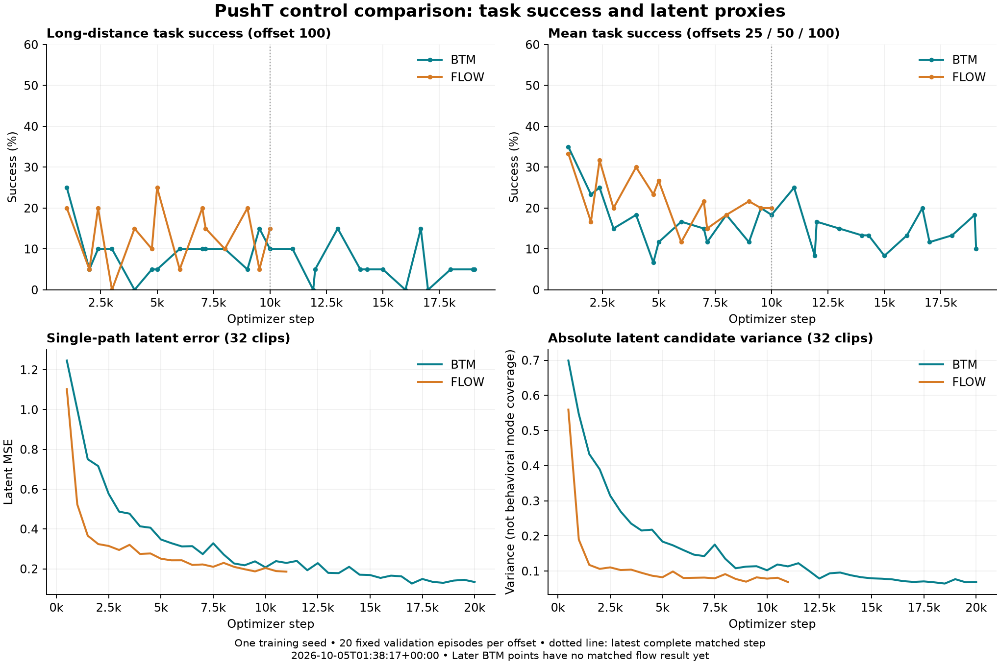

# PushT flow/BTM pilot: current progress

**Snapshot: October 5, 2026, 01:38:17 UTC / October 4, 9:38:17 PM EDT.**

The pilot has **not demonstrated improved long-horizon success or a speedup that retains success**. Both runs remain active; their selected checkpoints are still update 1,000. This is a single-seed validation study using frozen **LeWM on PushT**, not an exact published-LeFlow reproduction or a V-JEPA 2.1/Meta-World experiment.

The primary goal is higher success at dataset goal offset 100 under the same training-example and controller budgets. Secondary outcomes are success at offsets 25/50, mean success, and diagnostic errors. The efficiency goal is faster control while retaining success. Lower latent errors or fewer generator evaluations alone do not satisfy these goals.

## State and estimated completion

BTM uses A800 GPUs 0–3 and flow uses GPUs 4–7 concurrently. Each receives four GPUs, ten epochs, **23,830 updates**, global batch 128, microbatch 32, and 3,050,240 clip presentations. Seed 3072, data split/cache, optimizer settings, architecture dimensions, and controller settings match; flow has additional time-conditioning parameters. **Equal steps and GPU allocation do not establish equal FLOPs or GPU-hours.** Actual runtime must be reported separately.

| Method | Saved update / target | Latest complete evaluation | Finish estimate, Oct. 4 EDT | Planning range |
|---|---:|---:|---|---|
| BTM | 20,000 / 23,830 (83.9%) | 19,064 | **10:01 PM** | 9:57–10:05 PM |
| Flow | 11,000 / 23,830 (46.2%) | 10,000 | **11:09 PM** | 10:55–11:23 PM |

The 20,000/11,000 rollout cycles are incomplete and excluded from complete-cycle comparisons. Estimates include remaining training and scheduled validation for these runs only, excluding final tests and additional seeds. Evaluation accounts for approximately 18 of BTM's 22 remaining minutes and 80 of flow's 91. The [ETA model](../snapshots/20261005T013817Z/eta.json) fits recent completed evaluation cycles under concurrent load; ±15% rate sensitivity gives planning ranges, not confidence intervals.

**Resource limitation:** all eight GPUs are assigned, but [rank zero alone launches sequential rollout evaluations](https://github.com/Abecid/LeFlow-/blob/69babde283f504120dae3dfc6e9188a0e2242be4/train_subgoals.py#L488-L492); peers wait in a [collective](https://github.com/Abecid/LeFlow-/blob/69babde283f504120dae3dfc6e9188a0e2242be4/train_subgoals.py#L28-L40). High reported utilization can include NCCL waiting and does not establish productive work. Parallel evaluation is a future resource-efficiency priority; active settings remain unchanged.

Both methods remain frozen at [69babde283f504120dae3dfc6e9188a0e2242be4](https://github.com/Abecid/LeFlow-/commit/69babde283f504120dae3dfc6e9188a0e2242be4). Fifteen-minute monitoring is active. Report branch: `codex/server-launch-20261004`. The [monitoring protocol](../MONITORING.md) records collection, comparison, publication, and completion rules.

## Matched results

Each offset uses 20 fixed validation episode/start pairs, evaluation seed 42, and a 200-action budget.

| Checkpoint comparison | Method | Update | Success @25 | @50 | @100 | Mean |
|---|---|---:|---:|---:|---:|---:|
| Selected best | BTM | 1,000 | 40% | 40% | 25% | 35.00% |
| Selected best | Flow | 1,000 | 50% | 30% | 20% | 33.33% |
| Latest complete, matched | BTM | 10,000 | 30% | 15% | 10% | 18.33% |
| Latest complete, matched | Flow | 10,000 | 25% | 20% | 15% | 20.00% |
| Later BTM, unmatched budget | BTM | 19,064 | 20% | 5% | 5% | 10.00% |

At matched update 10,000, the primary BTM-minus-flow difference is **−5 percentage points**, paired episode-bootstrap 95% interval **[−25, +15]**. Two cases succeed only with BTM, three only with flow, and fifteen with neither. Selected-best offset-100 results differ by +5 points, interval [−15, +25]. Neither demonstrates superiority or equivalence. Intervals exclude training-seed uncertainty; repeated checkpoints reuse cases.

Actual `best.pt` metadata confirms update 1,000 for both. Selection maximizes mean validation success over all three offsets, retaining the earlier checkpoint on ties. These selected validation results require held-out confirmation after the method is frozen.

Evidence: [training/validation CSV](../snapshots/20261005T013817Z/training_metrics.csv), [rollout CSV](../snapshots/20261005T013817Z/evaluation_metrics.csv), [paired-success CSV](../snapshots/20261005T013817Z/paired_success.csv), [episode transitions](../snapshots/20261005T013817Z/episode_transitions.csv), [paired reports](../snapshots/20261005T013817Z/paired_evaluations.json), [summary/provenance](../snapshots/20261005T013817Z/summary.json), and [GPU/supervisor health](../snapshots/20261005T013817Z/health.json). A [direct dataset-probe and online-status receipt](../snapshots/20261005T013817Z/probe-online-receipt.json) independently confirms probe coverage; its 01:41 UTC online check is newer than the table snapshot.

## Failure evidence and diagnostic limits

**Observed:** offline path MSE improves from 1.000→0.207 for BTM and 0.524→0.204 for flow between updates 1,000 and 10,000, while primary success falls 25%→10% and 20%→15%. Candidate variance contracts 0.547→0.102 and 0.190→0.079 respectively. BTM still has greater absolute spread; this does not establish BTM-specific mode collapse. Raw generative losses optimize different objectives and are not comparable.

**Observed:** success fluctuates and individual cases regress. Earlier BTM offset-100 success reached zero at 16,000, rebounded to 15% at 16,681, and is now 5% at 19,064. Without trajectories, failures cannot be assigned to stalling, oscillation, contact errors, or infeasible proposals.

**Implementation limits:** observed residual compares an observation after five executed actions with a waypoint ten actions ahead. Predicted scores use longer, pre-CEM rollouts; CEM changes executed actions. These values cannot be subtracted as a calibrated dynamics error. Offset 100 describes dataset separation, while evaluation's modeled planning span remains 50 actions. The generation probe covers only 32 correlated clips from two episodes, and raw latent variance is not behavioral diversity. Inverse/consistency losses train the inverse head on recorded pairs, with **no gradient through generated waypoints**. Improved losses therefore do not establish feasible proposals. The world model remains frozen.

The [detailed audit frozen at 01:21:18 UTC](20261005T012118Z.md) preserves earlier per-case counts, source-line references, horizon semantics, and a manifest-checked probe-coverage recipe. Its numerical claims belong to that earlier snapshot.

## Next debug priorities

1. Replay available best/latest checkpoints with video, physical goal distance, actions, clipping, and per-case outcomes; separate failures and pre-success behavior.
2. Compare post-CEM five-action predictions with the next observations, measuring progress toward the same waypoint and actual goal.
3. Test ground-truth waypoint execution, then compare generators using one common frozen inverse head.
4. Test offset-aligned spacing and broader episode/spacing probes before changing objectives; record added model-rollout cost.

At matched update 10,000/offset 100, measured solver-batch latency is 1.135 seconds for BTM versus 1.594 for flow, approximately 1.41× descriptively. Different physical GPUs/load and excluded preprocessing/postprocessing prevent a causal full-controller speed claim. Confirm timing sequentially on the same idle GPU, with retained task success. Final evaluation requires held-out tests and additional matched training seeds; no such confirmation is available yet.

Live views: [shared group](https://wandb.ai/attentionx2023/btm-jepa/groups/pusht_pair_20261004), [BTM](https://wandb.ai/attentionx2023/btm-jepa/runs/z78m0zk6), [flow](https://wandb.ai/attentionx2023/btm-jepa/runs/g0u3w723). Live values may be newer.
