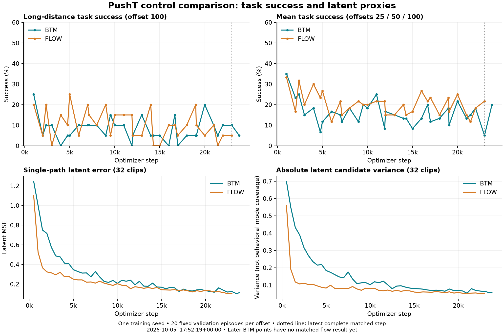

# PushT flow/BTM pilot: stopped-run assessment

**Snapshot: October 5, 2026, 17:52:19 UTC / 1:52:19 PM EDT.**

**No training workers are running. BTM reached its planned training/evaluation endpoint; flow stopped short.** Both selected checkpoints remain update 1,000. The pilot has **not demonstrated improved long-horizon success or a speedup that retains success**. These are single-seed validation results using frozen LeWM on PushT, not an exact published-LeFlow reproduction or V-JEPA 2.1/Meta-World study.

## Execution state

| Method | Last saved / planned updates | Last logged update | Complete rollout cycles | State |
|---|---:|---:|---:|---|
| BTM | 23,830 / 23,830 | 23,830 | 33 / 33 | Planned training and evaluations reached end |
| Flow | 23,000 / 23,830 | 23,040 | 32 / 33 | Incomplete; no worker/controller present |

BTM's final evaluation was written at **02:00:34 UTC**, and its final checkpoint at **02:00:36**, with epoch 10 and next batch 0. Its remaining `torchrun` entry is a zombie with exit code zero. Flow's recoverable checkpoint was written at **02:59:06**, its last evaluation at **03:03:20**, and its last metric at **03:03:23**. Forty logged updates after that checkpoint are not saved. Both completion markers are absent; the original supervisor is stopped and the concurrency status is stale.

W&B labels both runs “finished,” but flow's checkpoint and missing final evaluation show that this is **not proof of planned completion**. The exact interruption cause remains unknown; inspected logs contain no explanatory exception or signal. The accessible cumulative memory counter records one OOM kill, but gives no timestamp or process attribution, so this does not establish an OOM failure of flow. Kernel/user journals are unavailable. See the [interruption evidence](../snapshots/20261005T175219Z/interruption-evidence.json). There is **no current ETA while workers are inactive**; the [ETA record](../snapshots/20261005T175219Z/eta.json) preserves and invalidates the old cadence projection. Monitoring authorizes observation/reporting, not a restart or additional GPU work. See [online status](../snapshots/20261005T175219Z/online-status.json), [host/supervisor health](../snapshots/20261005T175219Z/health.json), and [monitoring rules](../MONITORING.md).

This check was scheduled at 01:45 UTC but SSH remained blocked pending network permission until approximately 17:52 UTC. Consequently there was a monitoring gap overnight; the stop time is reconstructed from durable records. All eight GPUs now show zero utilization and zero allocated memory.

## Goals and comparison budget

The primary goal is higher success at goal offset 100 with matched training examples and controller budgets. Secondary outcomes are success at offsets 25/50, mean success, and diagnostic errors. Efficiency requires faster control **with retained success**.

Each method was assigned four A800 GPUs, ten epochs, 23,830 planned updates, global batch 128, and microbatch 32. Seed 3072, split/cache, optimizer, architecture dimensions, and controller settings match; flow adds time-conditioning parameters. **Equal updates and allocation do not establish equal FLOPs or GPU-hours.** Final realized budgets differ because flow stopped early; compare at matched checkpoints. Both implementations remain frozen at [69babde283f504120dae3dfc6e9188a0e2242be4](https://github.com/Abecid/LeFlow-/commit/69babde283f504120dae3dfc6e9188a0e2242be4).

## Task outcomes

Each offset uses 20 fixed validation episode/start pairs, evaluation seed 42, and 200 executed actions.

| Comparison | Method | Update | Success @25 | @50 | @100 | Mean |
|---|---|---:|---:|---:|---:|---:|
| Selected best | BTM | 1,000 | 40% | 40% | 25% | 35.00% |
| Selected best | Flow | 1,000 | 50% | 30% | 20% | 33.33% |
| Latest matched | BTM | 23,000 | 5% | 0% | 10% | 5.00% |
| Latest matched | Flow | 23,000 | 45% | 15% | 5% | 21.67% |
| Final BTM, unmatched | BTM | 23,830 | 35% | 20% | 5% | 20.00% |

At 23,000, the primary BTM-minus-flow difference is **+5 percentage points**, paired bootstrap 95% interval **[−10, +20]**: two BTM-only successes, one flow-only, and seventeen failures under both. The shorter-offset differences favor flow: −40 points at offset 25, interval [−60, −20], and −15 at offset 50, interval [−30, 0]. These are exploratory contrasts after repeatedly inspecting fixed validation cases, not independent confirmatory tests.

Actual `best.pt` files still identify update 1,000, selected by highest mean success across offsets with earliest-checkpoint tie retention. Their primary difference is +5 points, interval [−15, +25]. Neither primary comparison establishes superiority or equivalence; intervals omit training-seed uncertainty.

Evidence: [training/validation CSV](../snapshots/20261005T175219Z/training_metrics.csv), [rollout CSV](../snapshots/20261005T175219Z/evaluation_metrics.csv), [paired-success CSV](../snapshots/20261005T175219Z/paired_success.csv), [case transitions](../snapshots/20261005T175219Z/episode_transitions.csv), [paired reports](../snapshots/20261005T175219Z/paired_evaluations.json), and [summary/provenance](../snapshots/20261005T175219Z/summary.json).

## Failure evidence and interpretation

| Offline validation metric | BTM 1k | BTM 23k | Flow 1k | Flow 23k |
|---|---:|---:|---:|---:|
| Single-path latent MSE | 1.0003 | 0.1240 | 0.5236 | 0.1063 |
| Candidate variance | 0.5468 | 0.0636 | 0.1897 | 0.0527 |
| Inverse action MSE | 0.09993 | 0.06549 | 0.10197 | 0.06486 |
| Dynamics consistency MSE | 0.008689 | 0.006969 | 0.008954 | 0.006713 |

Errors improve while task success fluctuates. BTM's final path MSE reaches 0.11175 despite 5% offset-100 success. Candidate spread contracts in both methods; BTM still has 1.21× flow's variance at 23k. This does not prove BTM-specific mode collapse. Raw generative losses optimize different objectives and are not directly comparable.

At offset 100, neither method retains any initial successes at 23k: BTM loses five and gains two; flow loses four and gains one. BTM also loses all five at its final checkpoint. Regression examples shared by both are `(episode,start)=(13082,3)` and `(8000,29)`. Three pairs never succeed under either method across all 32 matched checkpoints: `(13649,14)`, `(17889,25)`, `(1556,28)`. Without trajectories, these cannot be classified as stalling, oscillation, contact failure, or infeasible proposals.

**Diagnostic gaps remain:** observed residual compares five executed actions with a waypoint ten actions ahead; predicted scores precede CEM and use different horizons/actions. Offset 100 describes dataset separation, but planning spans 50 actions. Generation diagnostics cover 32 correlated clips from two episodes. Raw latent variance is not route diversity. Inverse/consistency losses train on recorded pairs with **no gradient through generated waypoints**; the world model stays frozen. Finite logs cannot prove clean process completion: all 4,848 metric rows and 195 rollout records pass numerical/consistency checks, without explaining the interruption.

## Next priorities

1. Preserve checkpoints and resolve execution provenance before any authorized recovery. Resume flow from the saved 23,000 checkpoint with the frozen protocol: 830 updates and its final evaluation remain, including replay of 40 logged but unsaved updates. Preserve the completed BTM run. Require a successful exit, final-checkpoint validation, and genuine controller handoff before claiming campaign completion.
2. Replay regressions and persistent failures with video, physical goal distance, actions, and clipping; separate pre-success behavior.
3. Align post-CEM five-action predictions with observations; test ground-truth waypoint execution and a shared inverse head.
4. Test horizon alignment and broader probes before objective changes. Evaluate parallel rollout execution separately: currently rank zero evaluates while peers wait, so high GPU utilization can include collective waiting.

At matched 23k/offset 100, solver-batch latency is 1.132 seconds for BTM versus 1.561 for flow, approximately 1.38× descriptively. Different GPUs/load and excluded preprocessing/postprocessing prevent a causal full-controller speed claim. Confirmation requires controlled timing, retained success, held-out tests, and additional training seeds; none is available yet.

Historical findings remain frozen in the [01:21 UTC detailed audit](20261005T012118Z.md) and [01:38 UTC progress report](20261005T013817Z.md). Live tracking: [group](https://wandb.ai/attentionx2023/btm-jepa/groups/pusht_pair_20261004), [BTM](https://wandb.ai/attentionx2023/btm-jepa/runs/z78m0zk6), [flow](https://wandb.ai/attentionx2023/btm-jepa/runs/g0u3w723).
